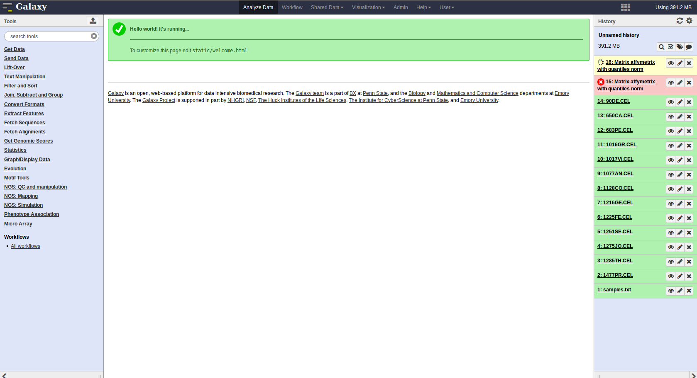
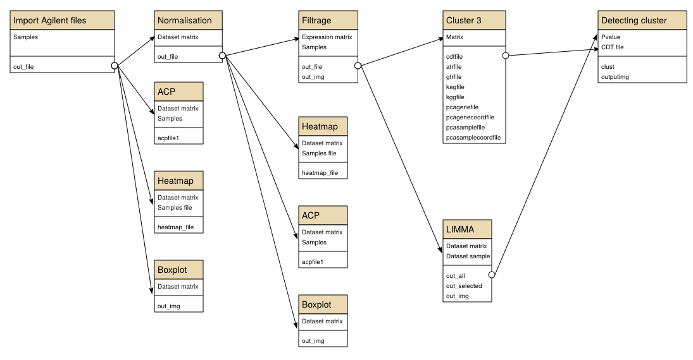

% Formation guide Galaxy : Micro-Array
% Edouard Hirchaud, Audrey Bihouée, Raluca Teusan
% 25 Septembre, 2014

[https://github.com/eHirchaud/presentationGalaxyMA](https://github.com/eHirchaud/presentationGalaxyMA)

Créer un compte galaxy
======================

Aller sur [http://cardioserve.nantes.inserm.fr/galaxy](http://cardioserve.nantes.inserm.fr/galaxy)

Dans la barre de navigation aller sur **User** puis **Register**

Créer un compte. L' **user** doit être un email. 

Attention au public name Galaxy n'accepte que les minuscules et le symbole  _

Description de l'interface
=========================

Panneau à droite : Les outils
-----------------

Comporte tous les outils (tools) classés par catégorie.

Les outils disponible dépendande de l'instance de Galaxy.

On trouve un mini moteur de recherche en haut de ce panneau.

Panneau à gauche : Historique
-----------------------------

Contient tous les dataset , les input les outputs.

Couleurs des dataset.

* Vert : Ok tout va bien
* Jaune : Patiance ça tourne
* Gris : En attente, dépend d'un autre **job** (généralement pas long)
* Bleu : En upload
* Rouge : Probléme probablement un mauvais fichier d'entrée ou un bug dans l'outil

Il est possible de renomer son historique en cliquant sur Unnamed history.
On peut également créer un nouvel historique

Barre de navigation
-------------------

* Analyze Data : pour revenir à la page principale (Analyse)
* Worklow : créer modifier des workflows.
* Shared Data : 

1. Données partagées, 
2. Publication d'historique,workflows, Pages, visualisations

* Visualisation : créer des visualisations
* Aide
* User : paramétre du compte, déconnection

Importation des data
====================

* Via l'outil d'upload de galaxy
* Via les library

1. Shared Data -
2. Data Libraries 
3. formation_agilent_files
4. Cliquer sur la boite à coté de Name
5. puis en bas For selected datasets : import to current history cliquer sur Go

Glossaire /jargon
=================

* Instance de Galaxy : Application web propre à un labo, Chaque instance est personalisé, dans le choix des outils, les quotas de stockages ect.. Il n'y a pas d'interpolarité entre les instances.
* Tool : Un formulaire permetant de rentrer les paramétres pour un script et qui décrit la façon de l'exécuter. Cela est opaque pour l'utilisateur standart. 
* Job : Lorsque l'on execute un outil la machine va lancé un job
* Dataset : C'est la donnée d'entré ou de sortie, Il ne s'agit pas seulement d'un fichier car elle contiend des métadonnées (type de données, base de données liée, comment elle à été généré ect...)
* Script : Le programme en question décrit par un outil.
* Workflow : Enchainement d'outils dont les inputs (entrées) d'outils sont les output (sorti) d'autres
* Toolshed : Application web différente de Galaxy qui contiend des outils rangé en catégorie. (Une sorte d'AppStore)
* Library : Ensemble de dataSet (spécifique à une instance)

Liens 
============

* [http://www.pf-bird.univ-nantes.fr/](http://www.pf-bird.univ-nantes.fr/) BiRD (Nantes)

* [http://abims.sb-roscoff.fr/](http://abims.sb-roscoff.fr/) ABiMS (Roscoff)

* [http://www.genouest.org/](http://www.genouest.org/) GenOuest (Rennes)

* [http://www.biogenouest.org/](http://www.biogenouest.org/) BioGenOuest (Grand Ouest)

